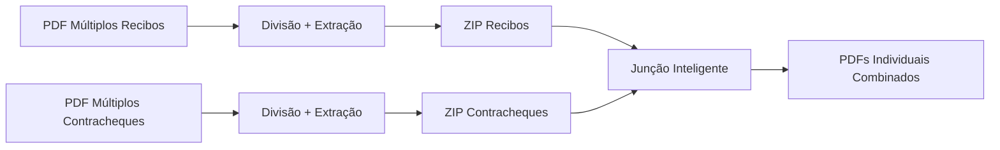
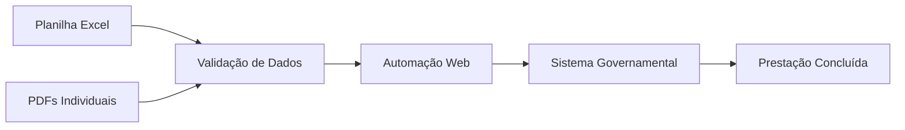

# Sistema Integrado de Processamento e Automação de Documentos

Sistema completo para processamento de documentos PDF e automação de prestação de contas, composto por duas aplicações complementares que otimizam fluxos burocráticos organizacionais.

## 📋 Visão Geral

Este sistema automatiza completamente o processo de prestação de contas, desde a preparação dos documentos até o envio automatizado para sistemas governamentais, reduzindo o tempo de processamento de horas para minutos.

### 🏗️ Arquitetura do Sistema

```
📁 Raiz do Projeto/
├── 🌐 extrator_docs/          # Aplicação 1: Processamento de Documentos
│   ├── 📊 documentsv2/        # Módulo: Divisão de Recibos
│   ├── 📊 documentsv3/        # Módulo: Divisão de Contracheques  
│   ├── 🔗 juncao/             # Módulo: Junção de Documentos
│   └── 🎛️ index.html          # Dashboard Principal
└── 🤖 robo-digitacao/         # Aplicação 2: Automação Web
    ├── 🐍 app.py               # Servidor de Automação
    ├── 📋 templates/           # Interface Web
    └── 📂 arquivos/            # Armazenamento de PDFs
```

## 🚀 Funcionalidades Principais

### 📄 Aplicação 1: Sistema de Processamento de Documentos
**Tecnologia**: Frontend puro (HTML5, JavaScript, PDF.js)

#### **🔧 Módulo 1: Divisão de Recibos**
- **Entrada**: PDF contendo múltiplos recibos
- **Processo**: Divisão manual por pontos de corte + extração automática de nomes
- **Saída**: ZIP com recibos individuais nomeados automaticamente

#### **🔧 Módulo 2: Divisão de Contracheques**
- **Entrada**: PDF contendo múltiplos contracheques
- **Processo**: Divisão inteligente + extração de nomes via algoritmo avançado
- **Saída**: ZIP com contracheques individuais organizados

#### **🔧 Módulo 3: Junção de Documentos**
- **Entrada**: ZIPs de recibos + ZIPs de contracheques
- **Processo**: Match inteligente de nomes + combinação em documentos únicos
- **Saída**: PDFs combinados por pessoa (recibo + contracheque)

### 🤖 Aplicação 2: Robô de Prestação de Contas
**Tecnologia**: Python Flask + Selenium WebDriver

#### **🔧 Funcionalidades:**
- **Upload e Validação**: Planilha Excel + PDFs processados
- **Automação Web**: Preenchimento automático de formulários governamentais
- **Monitoramento**: Logs em tempo real via WebSocket
- **Configuração**: Múltiplos órgãos e parcerias
- **Segurança**: Modo simulação para testes

## 🔄 Fluxo de Trabalho Completo

### **Fase 1: Preparação dos Documentos** (extrator_docs)



### **Fase 2: Automação da Prestação** (robo-digitacao)



## 📦 Instalação e Configuração

### **Pré-requisitos**
- **Aplicação 1**: Navegador web moderno (Chrome, Firefox, Edge)
- **Aplicação 2**: 
  - Python 3.7+
  - Google Chrome
  - ChromeDriver compatível

### **Instalação Rápida**

#### **1. Aplicação de Processamento (extrator_docs)**
```bash
# Não requer instalação - executa direto no navegador
# Abrir: extrator_docs/index.html
```

#### **2. Aplicação de Automação (robo-digitacao)**
```bash
# Windows
cd robo-digitacao
instalar.bat

# Linux
cd robo-digitacao
chmod +x instalar_linux.sh
./instalar_linux.sh
```

## 🎯 Como Usar o Sistema

### **Passo 1: Processamento de Documentos**

1. **Acesse**: `extrator_docs/index.html`
2. **Login**: Credenciais configuráveis
3. **Processe Recibos**:
   - Upload do PDF com múltiplos recibos
   - Definir pontos de corte
   - Download do ZIP com recibos individuais
4. **Processe Contracheques**:
   - Upload do PDF com múltiplos contracheques
   - Divisão automática
   - Download do ZIP com contracheques individuais
5. **Combine Documentos**:
   - Upload dos ZIPs gerados
   - Match automático por nomes
   - Download dos PDFs combinados

### **Passo 2: Automação da Prestação**

1. **Inicie o Robô**:
   ```bash
   cd robo-digitacao
   start.bat  # Windows
   ./start.sh # Linux
   ```
2. **Acesse**: `http://localhost:5000`
3. **Configure**:
   - Upload da planilha Excel
   - Upload dos PDFs processados
   - Configurar datas e órgãos
4. **Execute**:
   - Validação automática dos arquivos
   - Execução do robô com monitoramento
   - Acompanhamento via logs em tempo real

## ⚙️ Configuração Avançada

### **Sistema de Processamento (extrator_docs)**
```javascript
// Configurações em extrator_docs/index.html
const CONFIG = {
    loginRequired: true,
    defaultCredentials: {
        username: "admin",
        password: "admin123"
    }
};
```

### **Robô de Automação (robo-digitacao)**
```json
// Arquivo: robo-digitacao/config.json
{
    "url": "https://sistema-governamental.gov.br",
    "usuario": "seu_usuario",
    "senha": "sua_senha",
    "data_emissao": "DD/MM/AAAA",
    "data_pagamento": "DD/MM/AAAA"
}
```

## 📊 Formatos de Dados Suportados

### **Planilha Excel** (Entrada do Robô)
```
| Nome              | CPF           | Valor   |
|-------------------|---------------|---------|
| JOÃO DA SILVA     | 123.456.789-00| 1500.00 |
| MARIA SANTOS      | 987.654.321-00| 2000.00 |
```

### **PDFs** (Nomenclatura Automática)
```
Formato gerado: NOME_DO_FUNCIONARIO.pdf
Exemplo: JOAO_DA_SILVA.pdf
```

## 🛠️ Tecnologias Utilizadas

### **Frontend (extrator_docs)**
- **HTML5** + **CSS3** (Tailwind CSS)
- **JavaScript** (Vanilla ES6+)
- **PDF.js** (Processamento de PDFs)
- **PDF-lib** (Manipulação de PDFs)
- **JSZip** (Compressão de arquivos)

### **Backend (robo-digitacao)**
- **Python 3.7+**
- **Flask** + **SocketIO** (Servidor web + WebSocket)
- **Selenium WebDriver** (Automação web)
- **Pandas** + **OpenPyXL** (Processamento de dados)
- **ChromeDriver** (Controle do navegador)

## 🔒 Segurança e Privacidade

### **Processamento Local**
- ✅ **Aplicação 1**: Todos os PDFs processados localmente no navegador
- ✅ **Dados sensíveis**: Nunca enviados para servidores externos
- ✅ **Backups automáticos**: Planilhas com timestamp

### **Automação Segura**
- ✅ **Credenciais**: Armazenadas localmente em config.json
- ✅ **Modo simulação**: Testes sem envio real de dados
- ✅ **Logs detalhados**: Auditoria completa das operações

## 📈 Benefícios do Sistema

### **⚡ Eficiência**
- **Redução de tempo**: De 8 horas para 30 minutos
- **Automação completa**: Desde preparação até envio
- **Processamento em lote**: Centenas de documentos simultaneamente

### **🎯 Precisão**
- **Extração automática**: Elimina erros de digitação
- **Validação prévia**: Garante integridade dos dados
- **Match inteligente**: Funciona com nomes incompletos

### **🔧 Flexibilidade**
- **Configurável**: Múltiplos órgãos e parcerias
- **White Label**: Adaptável para qualquer organização
- **Modular**: Cada componente pode ser usado independentemente

## 🐛 Solução de Problemas

### **Problemas Comuns - Aplicação 1**
| Problema | Solução |
|----------|---------|
| **PDF não carrega** | Verificar se o arquivo não está corrompido |
| **Extração de nomes falha** | Verificar qualidade do PDF (não pode ser imagem) |
| **Download não funciona** | Verificar se o navegador permite downloads automáticos |

### **Problemas Comuns - Aplicação 2**
| Problema | Solução |
|----------|---------|
| **ChromeDriver erro** | Versão deve ser igual à do Chrome instalado |
| **Login falha** | Verificar credenciais no config.json |
| **PDFs não encontrados** | Verificar nomenclatura dos arquivos |
| **Planilha com erro** | Confirmar colunas obrigatórias (Nome, CPF, Valor) |

## 📞 Suporte e Manutenção

### **Logs do Sistema**
- **Aplicação 1**: Console do navegador (F12)
- **Aplicação 2**: Pasta `robo-digitacao/logs/`

### **Atualizações**
- **ChromeDriver**: Atualizar quando o Chrome for atualizado
- **Dependências Python**: `pip install -r requirements.txt --upgrade`

## 📝 Licença

Este sistema é fornecido como está, para uso interno organizacional. Adaptações para white label são permitidas e encorajadas.

## 🚀 Roadmap

- [ ] **Interface mobile** para monitoramento
- [ ] **API REST** para integração externa
- [ ] **Dashboard analítico** com métricas
- [ ] **Suporte a múltiplos idiomas**
- [ ] **Integração com mais sistemas governamentais**

---

**Sistema desenvolvido para otimizar processos burocráticos e aumentar a eficiência organizacional através da automação inteligente.**
